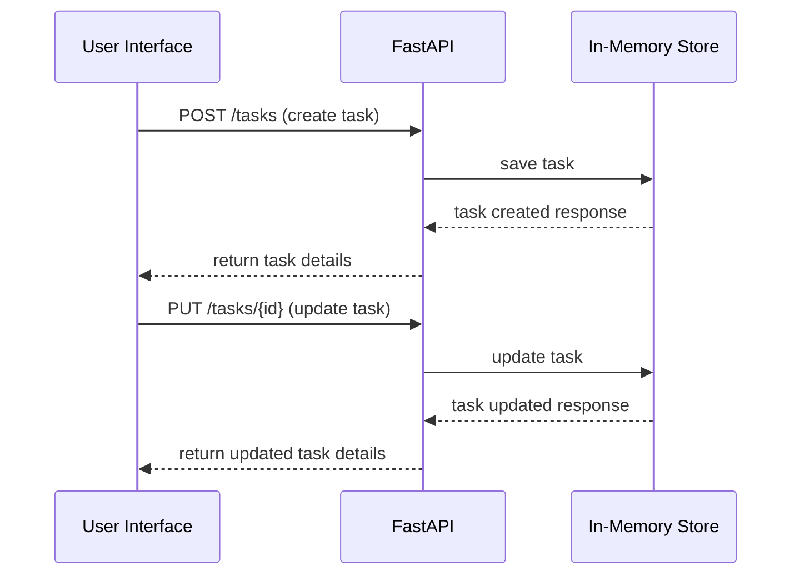

# Runtime Flow

This file describes the flow of data when a new task is created or updated in the Team Task Board application.

## API Request Flow

## Important Failure Behavior
- If the API encounters an error, appropriate error messages should be returned to the user interface.

## Files To Read Before Editing Flow
- `app/main.py`
- `app/routes.py`
- `app/models.py`
