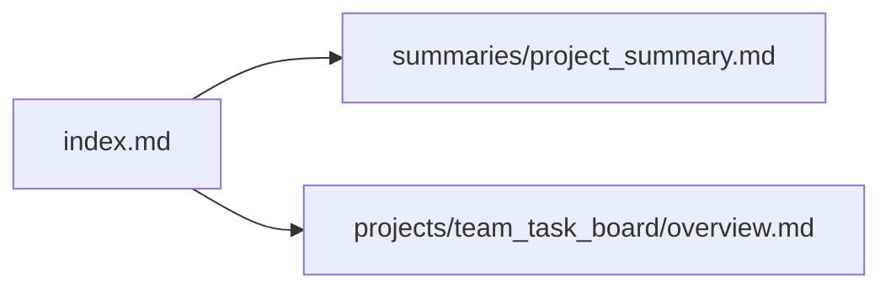

# Brain Knowledge Map

This file is the visual navigation layer for the brain. Humans can use it to understand the project shape. Agents can use it to decide which files to read next.

## Map Rules

- Every important file should be reachable from `index.md` or this map.
- New architecture files should link back to [System Overview](architecture/system_overview.md).
- New durable decisions should link from [Decision Log](decisions/decision_log.md).
- Integration files should link back to [Ingestion Pipeline](architecture/ingestion_pipeline.md).
