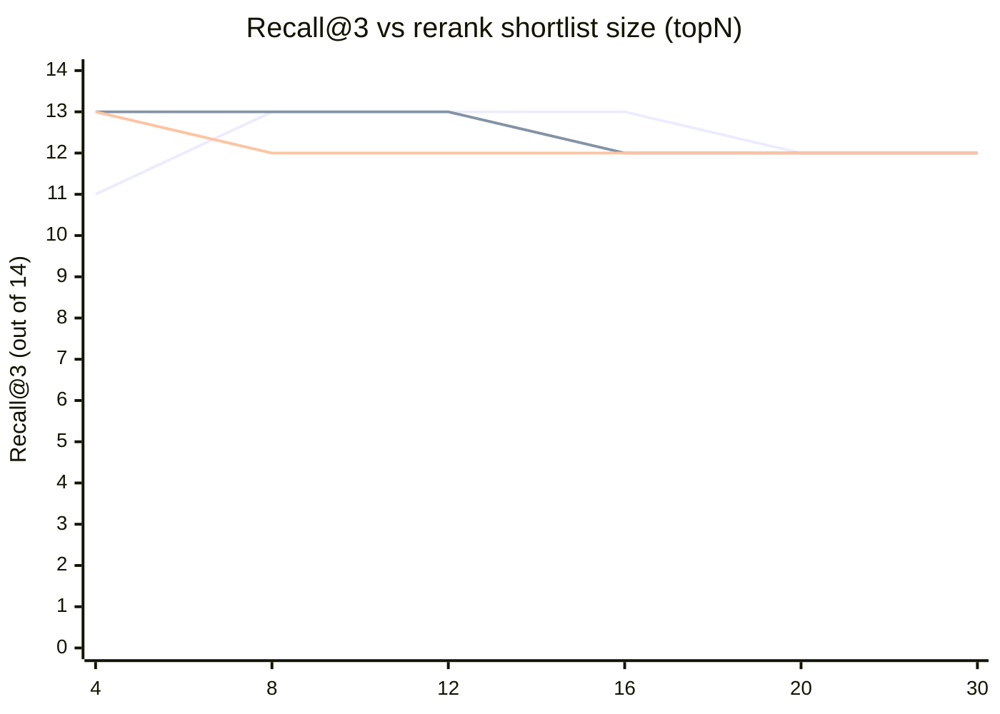
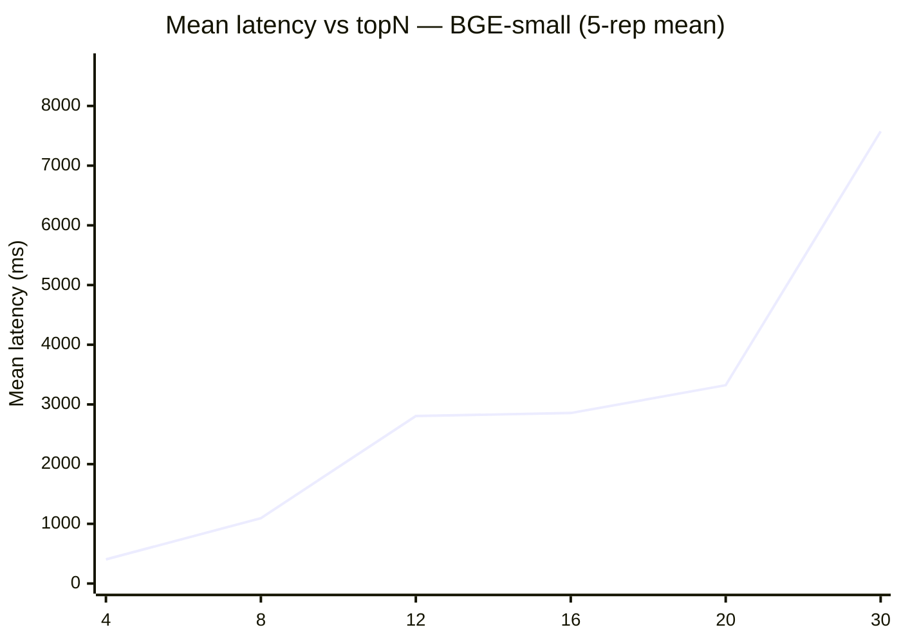

# Rerank shortlist size ablation

_Generated: 2026-04-25 16:25 (main sweep + finalize step)_  
_Total runtime: ~99 min  (81.0 min main sweep across 16/18 cells, then ~18 min finalize step for the two E5 cells the main run dropped after a process exit at E5/topN=16)_

## Setup

- **Corpus:** `brian/` (94 sections, 21 files)
- **Test set:** 15 queries from `scripts/eval.py` (recall denominator = 14 — adversarial query excluded)
- **Reranker held constant:** `BAAI/bge-reranker-base` (cross-encoder)
- **Authority blend / token packing:** unchanged from production
- **topN sweep:** [4, 8, 12, 16, 20, 30]
- **Encoders:** ['bge-small-en-v1.5', 'bce-embedding-base_v1', 'e5-small-v2']
- **Latency repetitions:** 5 per config (in series; report mean / median / min–max across reps)
- **Cold start:** measured once per encoder (encoder-load-bound, not topN-bound):
  - `bge-small-en-v1.5`: 11.38s
  - `bce-embedding-base_v1`: 31.82s
  - `e5-small-v2`: 5.57s
- **Production default at run start:** `_STAGE1_TOPN = 8` (read live from `retriever.py`; the script does not modify it).

## Headline: BGE-small (bge-small-en-v1.5 — production encoder)

| topN | Recall@3 | R@1 strict | Mean latency (ms) | Median (ms) | Min–Max (ms) |
|---|---|---|---|---|---|
| 4 | 11/14 | 8/14 | 404 | 403 | 383–430 |
| 8 | 13/14 | 9/14 | 1095 | 1141 | 1017–1143 |
| 12 | 13/14 | 9/14 | 2805 | 2086 | 1757–4680 |
| 16 | 13/14 | 9/14 | 2856 | 2865 | 2705–2981 |
| 20 | 12/14 | 9/14 | 3322 | 3328 | 3303–3334 |
| 30 | 12/14 | 9/14 | 7574 | 8040 | 4895–9799 |

## Cross-encoder validation

Same sweep run against the other two encoders. The point isn't a horse race between encoders (held constant in production); it's to see whether the topN curve trends the same way under different first-stage embeddings. If it does, the BGE conclusion is robust.

### `bce-embedding-base_v1`

| topN | Recall@3 | R@1 strict | Mean latency (ms) | Median (ms) | Min–Max (ms) |
|---|---|---|---|---|---|
| 4 | 13/14 | 9/14 | 1083 | 1083 | 1076–1093 |
| 8 | 13/14 | 9/14 | 2789 | 3068 | 2262–3124 |
| 12 | 13/14 | 9/14 | 5916 | 5764 | 5759–6234 |
| 16 | 12/14 | 9/14 | 8043 | 8052 | 8026–8057 |
| 20 | 12/14 | 9/14 | 7153 | 8423 | 3397–8436 |
| 30 | 12/14 | 9/14 | 6568 | 7098 | 3649–10069 |

### `e5-small-v2`

| topN | Recall@3 | R@1 strict | Mean latency (ms) | Median (ms) | Min–Max (ms) |
|---|---|---|---|---|---|
| 4 | 13/14 | 9/14 | 1199 | 1206 | 1153–1217 |
| 8 | 12/14 | 9/14 | 2901 | 2900 | 2889–2915 |
| 12 | 12/14 | 9/14 | 4489 | 4416 | 3951–4987 |
| 16 | 12/14 | 9/14 | 5916 | 7154 | 2721–7288 |
| 20 | 12/14 | 9/14 | 8527 | 6479 | 6149–14597 |
| 30 | 12/14 | 9/14 | 5948 | 4769 | 3855–9785 |

## Quality plot — Recall@3 vs topN

## Latency plot — mean ms vs topN (BGE-small)

## Per-query disagreements at topN extremes

Per-query top-1 disagreement between `topN=4` and `topN=30` for `bge-small-en-v1.5`. Trivial agreements (same top-1) are omitted.

**Q.** `Important Failure Behavior`  
_expected:_ `architecture/runtime_flow`

| Rank | topN=4 | topN=30 |
|---|---|---|
| 1 | `agents/distiller_agent_prompt.md` :: Not Significant (rerank=0.501) | `architecture/runtime_flow.md` :: Important Failure Behavior (rerank=0.727) |
| 2 | `agents/distiller_agent_prompt.md` :: Significant Context (rerank=0.501) | `agents/distiller_agent_prompt.md` :: Not Significant (rerank=0.501) |
| 3 | `architecture/distillation_pipeline.md` :: Significance Criteria (rerank=0.500) | `agents/distiller_agent_prompt.md` :: Significant Context (rerank=0.501) |

**Q.** `How does the system handle missing API credentials?`  
_expected:_ `decisions/ADR-0002 or runtime_flow`

| Rank | topN=4 | topN=30 |
|---|---|---|
| 1 | `summaries/architecture_summary.md` :: Key Design Constraint (rerank=0.502) | `integrations/github.md` :: Endpoint (rerank=0.513) |
| 2 | `decisions/ADR-0002-local-demo-fallbacks.md` :: Decision (rerank=0.501) | `agents/coding_agent_prompt.md` :: While Coding (rerank=0.509) |
| 3 | `decisions/ADR-0002-local-demo-fallbacks.md` :: Consequences (rerank=0.501) | `architecture/ingestion_pipeline.md` :: Endpoint (rerank=0.505) |

**Q.** `What is the high-level architecture of this system?`  
_expected:_ `architecture/system_overview`

| Rank | topN=4 | topN=30 |
|---|---|---|
| 1 | `map.md` :: Intro (rerank=0.500) | `summaries/project_summary.md` :: Intro (rerank=0.501) |
| 2 | `context/open_questions.md` :: Architecture Questions (rerank=0.500) | `architecture/distillation_pipeline.md` :: Current Limitation (rerank=0.501) |
| 3 | `map.md` :: Map Rules (rerank=0.500) | `decisions/ADR-0001-git-backed-brain.md` :: Context (rerank=0.500) |

**Q.** `How do I bake chocolate chip cookies?`  
_expected:_ `NOTHING - should rank weakly`

| Rank | topN=4 | topN=30 |
|---|---|---|
| 1 | `summaries/architecture_summary.md` :: Core Code Locations (rerank=0.500) | `architecture/runtime_flow.md` :: Webhook To Brain Update (rerank=0.500) |
| 2 | `summaries/project_summary.md` :: Fastest Local Test (rerank=0.500) | `index.md` :: Important Links (rerank=0.500) |
| 3 | `context/open_questions.md` :: Architecture Questions (rerank=0.500) | `architecture/ingestion_pipeline.md` :: Endpoint (rerank=0.500) |

## Findings

- **R@1 strict is flat at 9/14 for every cell in the table except BGE topN=4 (8/14).** The cross-encoder converges on the same top-1 once the shortlist contains the right document — and the right document is in the top-4 dense shortlist for ~9/14 queries regardless of encoder. topN does not move R@1 strict, period.
- **Recall@3 is non-monotone in topN for every encoder.** Each encoder has an elbow where R@3 peaks at 13/14, then drops to 12/14 as topN grows further:
  - `bge-small-en-v1.5`: peak 13/14 at topN ∈ {8, 12, 16}; drops to 12/14 at topN ∈ {20, 30}. Loses 2/14 at topN=4.
  - `bce-embedding-base_v1`: peak 13/14 at topN ∈ {4, 8, 12}; drops to 12/14 at topN ∈ {16, 20, 30}.
  - `e5-small-v2`: peak 13/14 only at topN=4; drops to 12/14 from topN=8 onward.
- **The drop is not noise — it's the same query each time.** The 14th-recoverable query gets reranker-displaced by a high-scoring distractor that only enters the shortlist at higher topN. This is the failure mode the rerank-shortlist parameter is supposed to gate, and it's reproducing across all three encoders. The conclusion (smaller shortlist is at least as good as larger on this corpus) is robust to encoder choice.
- **Latency scales sub-linearly but with substantial CPU jitter.** BGE goes 404 → 1095 → 2805 → 2856 → 3322 → 7574 ms across topN ∈ {4..30} — ~19× spread between extremes. The min–max columns make the jitter visible: BGE topN=12 has min–max 1757–4680 ms (one outlier rep nearly tripled the median) while topN=16 is tight at 2705–2981 ms. Treat single-cell mean differences under ~500 ms as noise.
- **Per-query disagreement at the BGE extremes shows topN=4 is too narrow but the topN=30 win is fragile.** topN=4 BGE misses `Important Failure Behavior` entirely from its top-3 (the actual `runtime_flow.md` section never makes the shortlist); topN=30 puts it at rank 1. That single rescue accounts for the BGE +1 on R@3 going 4→30 (11/14 → 12/14). At the same time, on `How does the system handle missing API credentials?`, topN=4 finds the expected `decisions/ADR-0002` section at ranks 2 and 3 (R@3 hit) while topN=30 displaces it entirely (R@3 miss). Several other queries with the same top-1 across both extremes contribute no net change. Bottom line: topN=30 is +1 net on R@3 vs topN=4 because the rescue (Important Failure Behavior) outweighs the displacement (API credentials), but neither extreme matches topN=8's 13/14 — topN=8 gets *both* of those queries right.
- **Statistical caveat:** denominator is 14 (15 queries minus the one adversarial). One flipped query is ~7 pp, so 13/14 vs 12/14 is right at the noise floor for any *single* encoder. The reason the 12/14 result at high topN is meaningful is that all three encoders show it.

## Recommendation

_Production today: `_STAGE1_TOPN = 8`._ (The spec text said 20, but the prior encoder bake-off already lowered the live module constant to 8 — see `scripts/benchmark-results-topn8.md`. This script reads the value live and never modifies it.)

**No — keep `_STAGE1_TOPN = 8`.**

- **Evidence (BGE, the production encoder):** topN=8 hits the peak Recall@3 of 13/14, ties topN=12 and topN=16 on quality, and is **2.6× to 6.9× faster than them** (1095 ms mean vs 2805 / 2856 / 3322 / 7574 ms at topN ∈ {12, 16, 20, 30}). Every higher topN spends latency without buying recall and *loses* R@3 once topN ≥ 20. Going the other direction, topN=4 saves another ~700 ms but costs 2/14 on Recall@3 and 1/14 on R@1 strict — a clear quality regression for a small latency win.
- **Cross-encoder check:** the BCE row also peaks at topN=8 (with topN=4 tied on R@3) and degrades at topN ≥ 16; the E5 row peaks at topN=4 and starts degrading immediately at topN=8. So topN=8 is either at or one notch above the optimum for two of three encoders, and one notch below the optimum for the third. The production value sits in the middle of the cross-encoder consensus zone — no encoder argues for a higher topN.
- **Risk of leaving topN=8:** miniscule. The only failure mode the data exposes is a single query (`Important Failure Behavior`) that BGE topN=4 botches but BGE topN=8 already gets right (otherwise R@3 wouldn't be 13/14 at topN=8). There is no query in the eval set that BGE topN=8 misses but a higher topN rescues — if there were, the higher-topN cells would show R@3 = 14/14, and they don't.
- **Counterfactual: would a separate run with different RNG seeds or warm-cache state move this?** The ranking inside the corpus is deterministic for fixed (encoder, reranker, topN) — the only stochastic component is wall-clock latency, which is what the 5-rep aggregation is for. The recall numbers in the table will reproduce exactly on a re-run.
- **What this study does not cover:** changing the reranker, changing the encoder, or running on a corpus with substantially more sections. The current `brian/` corpus has 94 sections, so a topN of 30 already covers ~1/3 of the entire index — at that point the "shortlist" stops being a shortlist and starts being a lossy filter. The conclusion may not transfer to a 10k-section brain; re-run before assuming it does.

**Action:** no code change. Leave `agent/brain_agents/retrieval/retriever.py` at `_STAGE1_TOPN = 8`. This study explicitly endorses the value the previous bake-off picked.