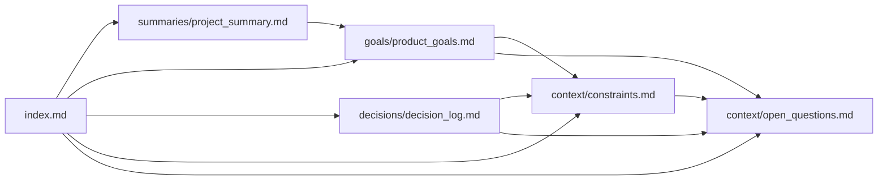

# CampusCompanion Knowledge Map

This file is the visual navigation layer for the CampusCompanion brain. Humans can use it to understand the project shape. Agents can use it to decide which files to read next.

## Map Rules

- Every important file should be reachable from `index.md` or this map.
- New durable decisions should link from [Decision Log](decisions/decision_log.md).
- New constraints should link from [Constraints](context/constraints.md).
- New open questions should link from [Open Questions](context/open_questions.md).
