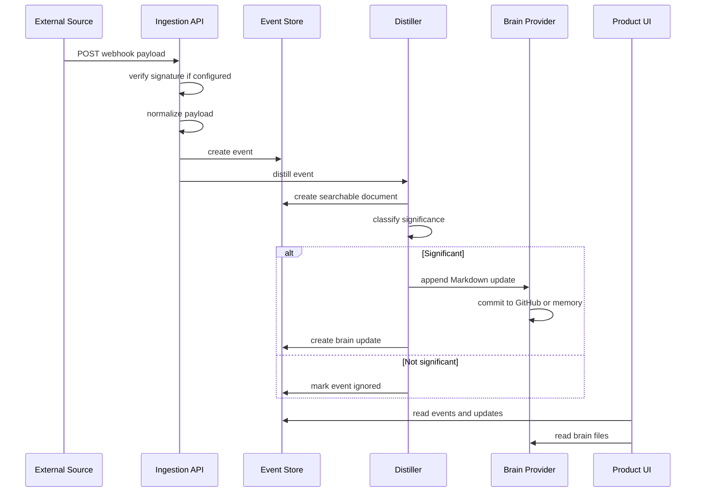

# Runtime Flow

This file describes what happens when a new piece of human context enters the system.

## Webhook To Brain Update

## Important Failure Behavior

- If no database is configured, `src/lib/db/store.ts` falls back to memory.
- If no OpenAI key is configured, `src/lib/llm/client.ts` falls back to deterministic embeddings and heuristic distillation.
- If no GitHub brain repo is configured, `src/lib/brain/provider.ts` falls back to memory.
- Placeholder database URLs should be ignored so local demo mode does not attempt a fake network connection.

## Files To Read Before Editing Flow

- `src/app/api/ingest/[source]/route.ts`
- `src/lib/ingest/service.ts`
- `src/lib/distiller/index.ts`
- `src/lib/db/store.ts`
- `src/lib/brain/provider.ts`
